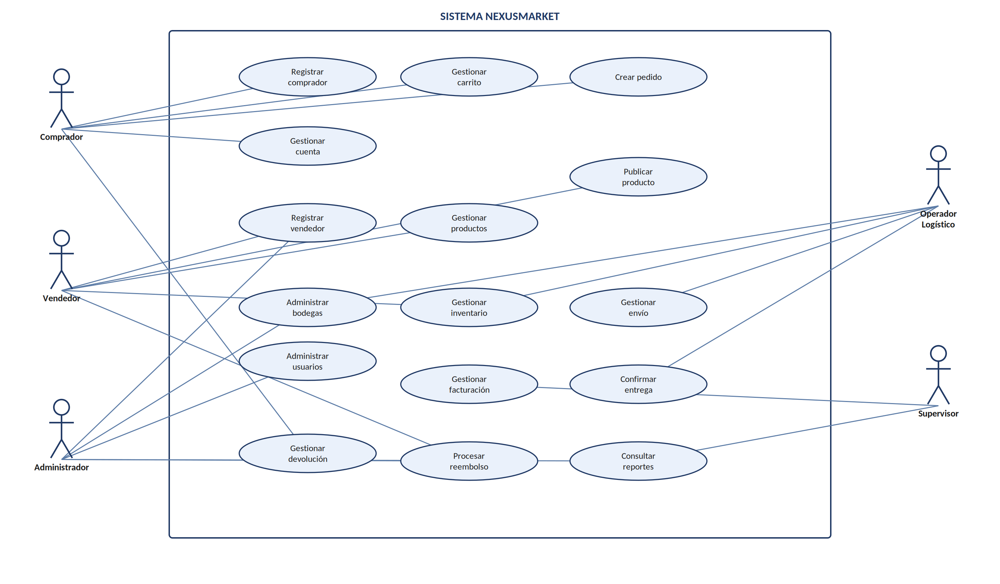

# 17–19. Casos de Uso

## 17. Catálogo General de Casos de Uso

A partir de los participantes y procesos definidos en el negocio se identifican quince casos de
uso, que cubren la totalidad de los dominios funcionales descritos.

| ID | Caso de uso | Actor principal |
|---|---|---|
| CU-01 | Administrar usuarios | Administrador |
| CU-02 | Registrar comprador | Comprador |
| CU-03 | Registrar vendedor | Administrador |
| CU-04 | Administrar bodegas | Administrador / Operador Logístico |
| CU-05 | Gestionar productos | Vendedor |
| CU-06 | Publicar producto | Vendedor |
| CU-07 | Administrar inventario | Vendedor / Operador Logístico |
| CU-08 | Gestionar carrito | Comprador |
| CU-09 | Crear pedido | Comprador |
| CU-10 | Gestionar facturación | Sistema / Responsable administrativo |
| CU-11 | Gestionar envío | Operador Logístico |
| CU-12 | Confirmar entrega | Operador Logístico |
| CU-13 | Gestionar devolución | Comprador / Vendedor |
| CU-14 | Procesar reembolso | Administrador / Vendedor |
| CU-15 | Consultar reportes | Supervisor / Administrador |

*Tabla 13. Catálogo general de casos de uso del sistema.*

## 18. Diagrama General de Casos de Uso

Representación gráfica de los casos de uso, agrupados por dominio funcional e identificados con
su actor principal:

*Figura 1. Diagrama general de casos de uso del sistema NexusMarket.*

## 19. Especificación de Casos de Uso Críticos

Los siguientes seis casos de uso se consideran críticos por representar el núcleo transaccional
del sistema.

| Caso | Precondiciones | Flujo principal | Resultado |
|---|---|---|---|
| CU-03 — Registrar vendedor | Administrador autorizado. | Ingresar datos → validar → crear vendedor → asociar primera bodega. | Vendedor registrado. |
| CU-05 — Gestionar producto | Vendedor registrado. | Registrar datos → seleccionar tipo → definir variantes → guardar. | Producto disponible para publicación. |
| CU-08 — Gestionar carrito | Comprador activo. | Consultar producto → agregar → modificar cantidad → calcular total. | Carrito actualizado. |
| CU-09 — Crear pedido | Carrito con productos válidos. | Validar inventario → confirmar carrito → generar pedido. | Pedido en Pendiente de Pago. |
| CU-11 — Gestionar envío | Pedido pagado. | Preparar → despachar → transportar → entregar. | Envío entregado. |
| CU-13 — Gestionar devolución | Pedido elegible. | Solicitar → validar → decidir → actualizar pedido/inventario. | Devolución procesada o rechazada. |

*Tabla 14. Especificación funcional de los casos de uso críticos.*
