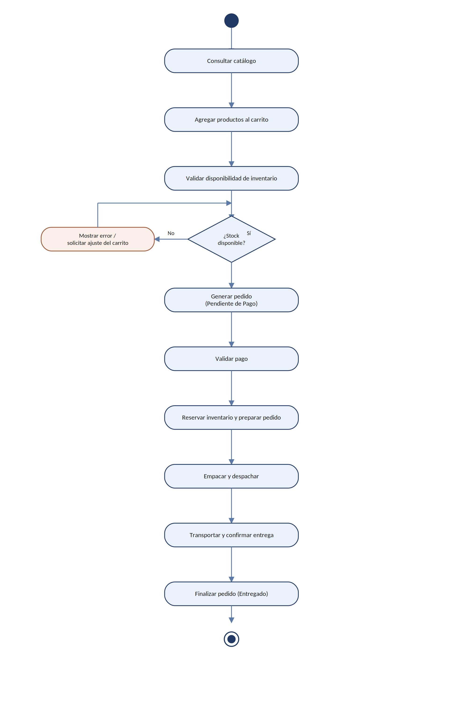

# 20. Diagrama de Actividad — Proceso de Compra

Modela el flujo de actividades correspondiente al proceso de compra, desde la consulta del
catálogo hasta el cierre del pedido, incluyendo el punto de decisión sobre la disponibilidad de
stock.

*Figura 2. Diagrama de actividad del proceso de compra.*
