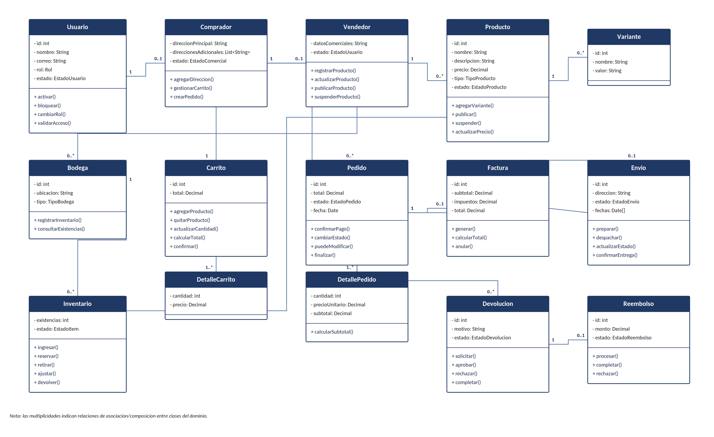

# 24–25. Diagrama UML de Clases y Relaciones

## 24. Diagrama UML de Clases

Diagrama de clases del modelo de dominio propuesto. Las multiplicidades representan las
relaciones principales identificadas para la implementación en Java, detalladas en la sección 25.

*Figura 3. Diagrama UML de clases del dominio NexusMarket.*

## 25. Relaciones y Multiplicidades

| Relación | Multiplicidad | Descripción |
|---|---|---|
| Usuario — Comprador | 1 — 0..1 | Un usuario puede corresponder a un comprador. |
| Usuario — Vendedor | 1 — 0..1 | Un usuario puede corresponder a un vendedor. |
| Vendedor — Producto | 1 — 0..* | Un vendedor administra sus productos. |
| Vendedor — Bodega | 1 — 0..* | Un vendedor puede tener bodegas propias. |
| Producto — Variante | 1 — 0..* | Un producto puede tener variantes. |
| Producto / Bodega — Inventario | 1 — 0..* | El inventario se distribuye por producto y bodega. |
| Comprador — Carrito | 1 — 1 | Cada comprador posee un carrito activo. |
| Carrito — DetalleCarrito | 1 — 1..* | El carrito contiene una o más líneas de producto. |
| Comprador — Pedido | 1 — 0..* | Un comprador puede generar múltiples pedidos. |
| Pedido — DetallePedido | 1 — 1..* | Cada pedido contiene una o más líneas. |
| Pedido — Factura | 1 — 0..1 | Una venta puede generar su factura. |
| Pedido — Envio | 1 — 0..1 | Los pedidos con productos físicos generan un envío. |
| Pedido — Devolucion | 1 — 0..* | Un pedido puede tener procesos de devolución asociados. |
| Devolucion — Reembolso | 1 — 0..1 | Una devolución aprobada puede originar un reembolso. |

*Tabla 18. Relaciones y multiplicidades del modelo de clases.*
