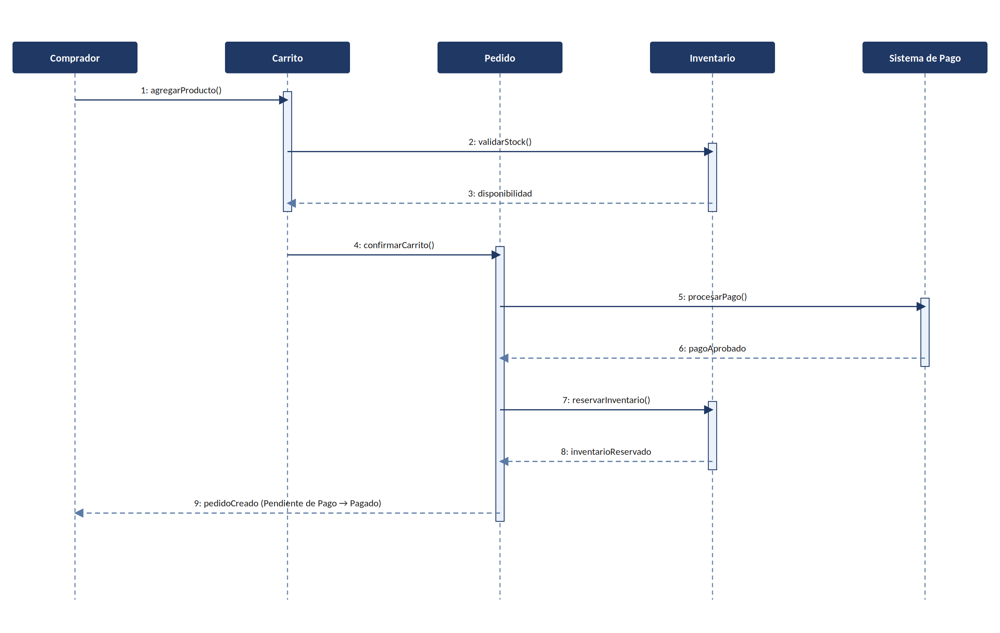

# 26. Diagrama de Secuencia — Creación de Pedido

Ilustra la interacción entre los objetos del sistema durante el caso de uso CU-09 (Crear pedido),
desde que el comprador agrega un producto al carrito hasta la confirmación del pedido como Pagado.

*Figura 4. Diagrama de secuencia del proceso de creación de pedido.*
