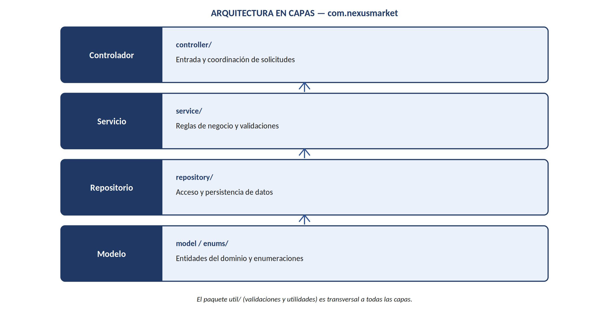

# 28–29. Arquitectura Propuesta y Estructura del Repositorio

## 28. Arquitectura Propuesta para Java

La arquitectura de software no está definida por la especificación funcional original (sección
3.2); por ello se propone una organización en capas, apropiada para un proyecto académico de
tercer semestre y alineada con las buenas prácticas de separación de responsabilidades.



*Figura 5. Arquitectura en capas propuesta para la implementación en Java.*

```
src/main/java/com/nexusmarket/
├── model/       Entidades del dominio
├── enums/       Roles, tipos y estados
├── repository/  Persistencia
├── service/     Reglas de negocio
├── controller/  Entrada y coordinación
└── util/        Validaciones y utilidades
```

## 29. Estructura Propuesta del Repositorio (implementada en este repo)

```
NexusMarket/
├── README.md
├── LICENSE
├── .gitignore
├── .vscode/
│   └── settings.json
├── SDD/                                  # Este documento de análisis y diseño
│   ├── README.md
│   ├── 00-portada-y-control-cambios.md
│   ├── 01-introduccion-y-contexto.md
│   ├── 02-descripcion-del-negocio.md
│   ├── 03-dominios-funcionales.md
│   ├── 04-restricciones-y-validaciones.md
│   ├── 05-casos-de-uso.md
│   ├── 06-diagrama-actividad.md
│   ├── 07-modelo-de-clases.md
│   ├── 08-diagrama-clases-y-relaciones.md
│   ├── 09-diagrama-secuencia.md
│   ├── 10-trazabilidad.md
│   ├── 11-arquitectura-y-repositorio.md
│   ├── 12-implementacion.md
│   ├── 13-glosario-y-conclusiones.md
│   ├── NexusMarket_Analisis_y_Diseno.docx
│   └── diagramas/
│       ├── 01_diagrama_casos_de_uso.png
│       ├── 02_diagrama_actividad_compra.png
│       ├── 03_diagrama_clases_uml.png
│       ├── 04_diagrama_secuencia_pedido.png
│       └── 05_arquitectura_capas.png
└── nexusmarket/                          # Proyecto Java (Maven)
    ├── pom.xml
    └── src/
        ├── main/java/com/nexusmarket/
        │   ├── model/
        │   ├── enums/
        │   ├── repository/
        │   ├── service/
        │   ├── controller/
        │   └── util/
        └── test/java/com/nexusmarket/
```

Esta estructura sigue el mismo patrón usado en proyectos académicos comparables de la asignatura
(documento de diseño en `SDD/` + código fuente en un módulo Maven independiente), de modo que el
repositorio quede organizado en dos partes claramente separadas: **especificación** y
**implementación**.
