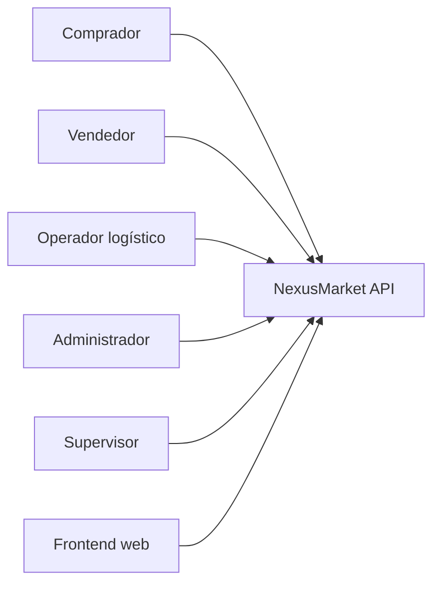

# Nivel 1 — Contexto

```mermaid
flowchart LR
  B[Comprador] --> S
  V[Vendedor] --> S
  L[Operador logístico] --> S
  A[Administrador] --> S
  U[Supervisor] --> S
  S[NexusMarket API]
  F[Frontend web] --> S
```

Actores: comprador, vendedor, operador logístico, administrador y supervisor. Sistema externo: frontend web (`FRONTEND_ORIGIN`).
