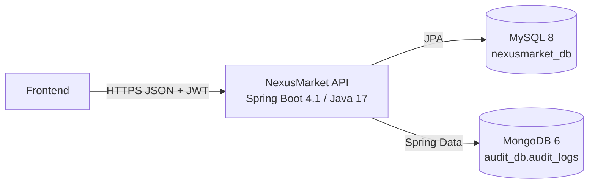

# Nivel 2 — Contenedores

```mermaid
flowchart LR
  F[Frontend] -->|HTTPS JSON + JWT| API[NexusMarket API<br/>Spring Boot 4.1 / Java 17]
  API -->|JPA| M[(MySQL 8<br/>nexusmarket_db)]
  API -->|Spring Data| G[(MongoDB 6<br/>audit_db.audit_logs)]
```

Despliegue: `docker-compose.yml` levanta `mysql-db`, `mongo-db` y `nexusmarket-app`.
