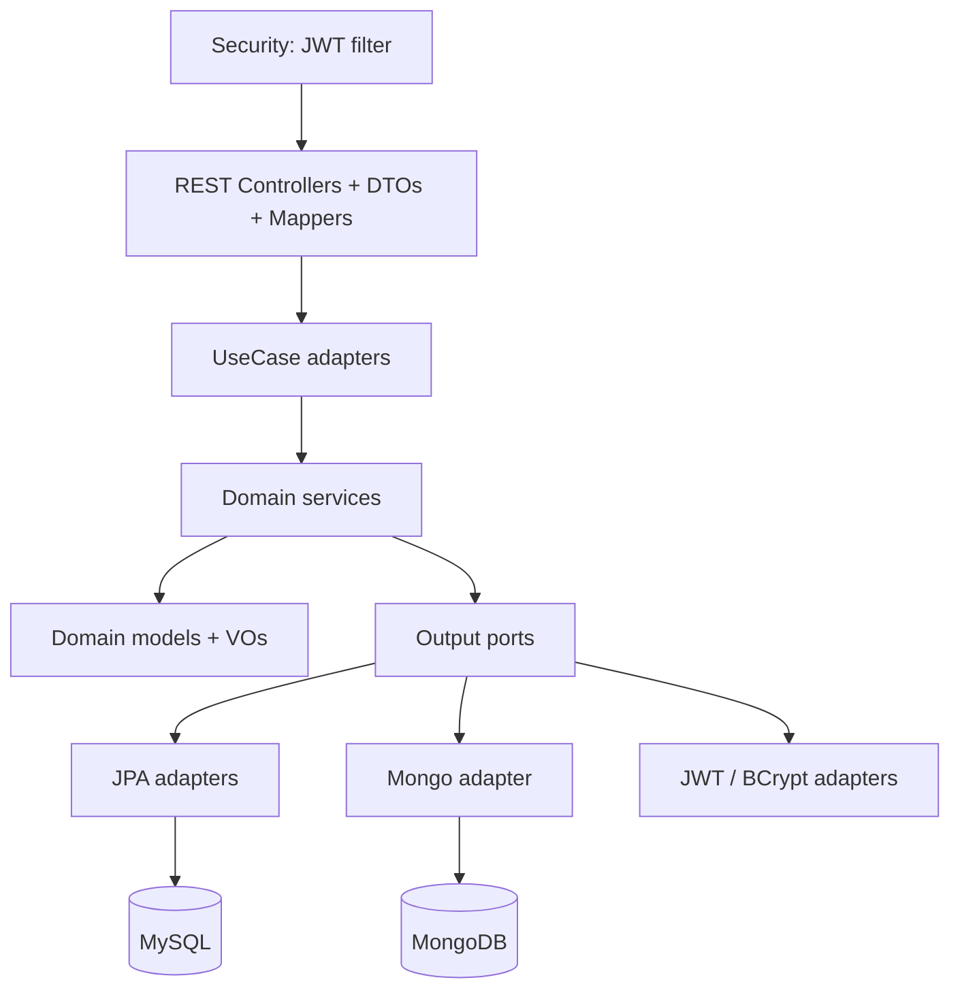

# Nivel 3 — Componentes

```mermaid
flowchart TB
  C[REST Controllers + DTOs + Mappers] --> UC[UseCase adapters]
  SEC[Security: JWT filter] --> C
  UC --> DS[Domain services]
  DS --> M[Domain models + VOs]
  DS --> OP[Output ports]
  OP --> JPA[JPA adapters]
  OP --> MON[Mongo adapter]
  OP --> JWT[JWT / BCrypt adapters]
  JPA --> MySQL[(MySQL)]
  MON --> Mongo[(MongoDB)]
```
