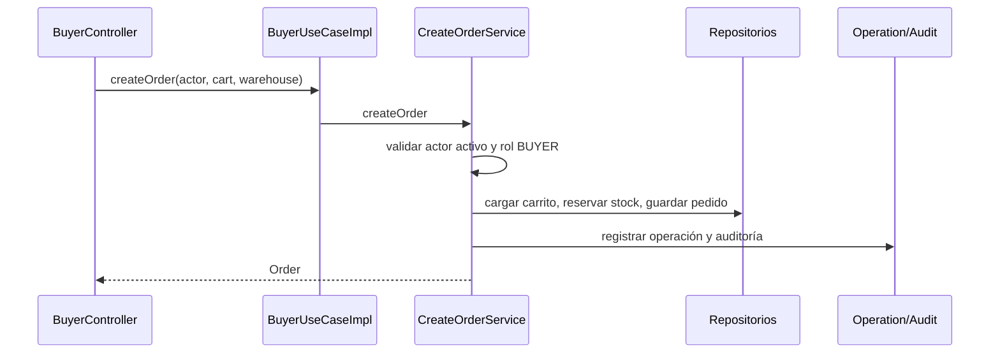

# Capa adapters

Ver [`SDD/Adapters`](../Adapters/): REST, use cases, persistencia (JPA/Mongo), seguridad, configuración y notificación.

## Flujo de ejemplo: crear pedido

```mermaid
sequenceDiagram
  participant C as BuyerController
  participant U as BuyerUseCaseImpl
  participant S as CreateOrderService
  participant R as Repositorios
  participant A as Operation/Audit
  C->>U: createOrder(actor, cart, warehouse)
  U->>S: createOrder
  S->>S: validar actor activo y rol BUYER
  S->>R: cargar carrito, reservar stock, guardar pedido
  S->>A: registrar operación y auditoría
  S-->>C: Order
```
